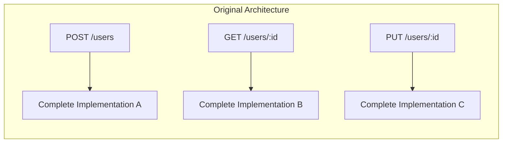
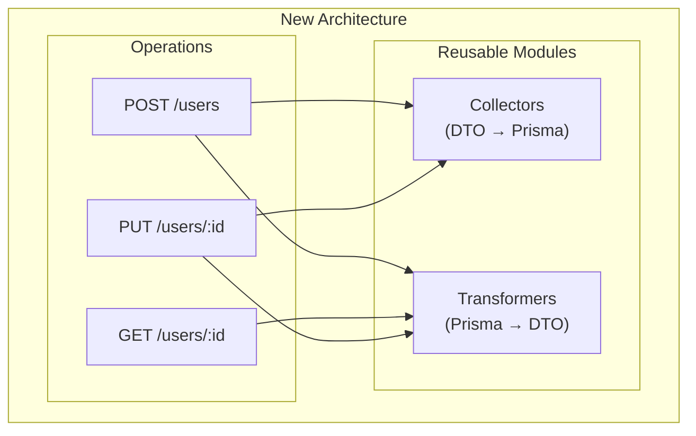
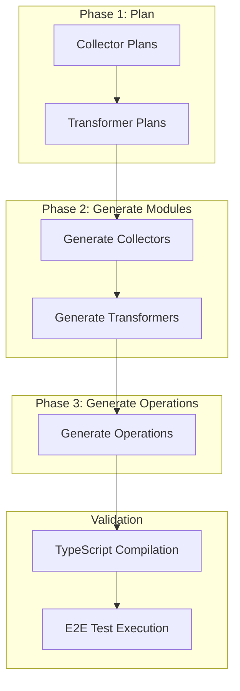

<!--
[AutoBE] From 100% to 40% Back to 100%: How We Rebuilt Our Code Generation for Real-World Maintainability
-->

## Preface

- Github Repository: https://github.com/wrtnlabs/autobe
- Benchmark Results: https://autobe.dev/playground/benchmark

We achieved 100% compilation success once. Then we threw it all away and rebuilt from scratch. This is the story of why we did it, and how we clawed our way back to 100%.

## The Original Success (And Its Hidden Problem)

[`AutoBE`](https://github.com/wrtnlabs/autobe) was originally designed for the Korean SI (System Integration) market. Korean SI development, particularly in finance, healthcare, and government sectors, follows strict waterfall methodologies with a unique principle: **each API function and test function must be developed completely independently**.

This means:
- No shared utility functions
- No code reuse between API endpoints
- Every operation is self-contained

We followed this principle religiously. And it worked — we achieved 100% compilation success and near-100% runtime success rates.



Each API had its own complete implementation. No dependencies. No shared code. The AI generated each function in isolation, and the compiler validated them independently.

### Why SI Development Works This Way

The logic behind this approach isn't arbitrary. In regulated industries:

- **Separation of responsibility**: Each developer is accountable for their specific functions
- **Regulatory compliance**: Auditors need to trace exactly which code handles which data
- **Conservative stability**: Changing shared code risks cascading failures

I once reviewed code written by bank developers. They had a function to format numbers with thousand separators (e.g., 3,000,000) — duplicated identically across dozens of API endpoints. From their perspective, this was correct: no shared dependencies means no shared risk.

### The Real-World Problem

Then we tried to use AutoBE for actual commercial projects.

**Requirements changed.**

In a waterfall approach, changing requirements should be handled at the specification phase. But reality doesn't follow textbooks. Clients change their minds. Market conditions shift. What seemed like a final specification evolves.

And with our "no code reuse" architecture, every small change was amplified across the entire codebase.

> "Can you add a `created_by` field to track who created each record?"

Simple request. But with 50 endpoints that handle record creation, we had to regenerate 50 completely independent implementations. Each one needed the exact same change. Each one had to be validated independently.

**It was hell.**

We understood why SI development enforces these patterns. But we weren't building applications for 20-year maintenance cycles with teams of specialized maintainers. We were building prototypes to accelerate development — and our architecture made iteration painfully slow.

## The Decision: Embrace Modularity

We made a radical choice: **rebuild AutoBE to generate modular, reusable code**.



The new architecture separates concerns into three layers:

1. **Collectors**: Transform request DTOs into Prisma create/update inputs
2. **Transformers**: Convert Prisma query results back to response DTOs
3. **Operations**: Orchestrate business logic using collectors and transformers

When requirements change, you update the collector or transformer once, and all dependent operations automatically get the fix.

### The Immediate Consequence

**Compilation success dropped to under 40%.**

The moment we introduced code dependencies between modules, everything became harder:

- Circular dependency detection
- Import ordering validation
- Type inference across module boundaries
- Interface compatibility between generated modules

Our AI agents, optimized for isolated function generation, suddenly had to understand relationships. They had to know that `UserCollector.collect()` returns something compatible with `prisma.user.create()`. They had to understand that `UserTransformer.transform()` expects the exact shape that `UserCollector` produces.

The self-healing feedback loops we relied on — compiler diagnostics feeding back to AI agents — were overwhelmed by cascading errors. Fix one module, break three others.

## The Road Back to 100%

We spent months rebuilding. Here's what it took.

### 1. RAG Optimization for Context Management

The first breakthrough was realizing our AI agents were drowning in context. With modular code, they needed to understand:
- The database schema
- All related collectors
- All related transformers
- The OpenAPI specification
- Business requirements

Passing all of this in every prompt was token-expensive and noisy. The AI couldn't find the relevant information in the sea of context.

We implemented a hybrid RAG system:

```typescript
// Vector embedding for semantic search
const embedder = new LocalEmbeddingProvider({
  modelIdOrPath: "Xenova/all-MiniLM-L6-v2",
  quantized: true,
  batchSize: 32,
  enableCache: true,
});

// Hybrid search combining cosine similarity and BM25
const relevantSections = await hybridSearch(
  queryText,
  requirements,
  { cosineSimilarity: 0.5, bm25: 0.5 }
);
```

Now, when generating a `UserCollector`, the system retrieves only the relevant requirement sections — not the entire 100-page specification. Token usage dropped by 90%. More importantly, AI output quality improved because it could focus on what matters.

### 2. Local LLM Edge Case Discovery

Cloud APIs like GPT-4.1 are expensive for iteration. Each failed compilation costs tokens. When you're running hundreds of experiments to find edge cases, costs add up fast.

We deployed local LLMs to discover failure modes cheaply:

| Model | Success Rate | Use Case |
|-------|-------------|----------|
| `qwen3-coder-450b` | 0% | Identified fundamental AST generation failures |
| `qwen3-235b-a22b` | 60% | Revealed prompt ambiguity issues |
| `qwen3-next-80b-a3b` | 85% | Production-viable local alternative |

The 0% success rate with `qwen3-coder` wasn't a failure — it was invaluable. It exposed every weakness in our prompts, every ambiguity in our AST schemas, every edge case in our compilers. Fixing these issues for a weak model made the system robust for all models.

### 3. Compiler Logic Reinforcement

Our compilers needed to handle new failure modes:

**Neighbor Detection**: Each module must declare its dependencies.

```typescript
// Auto-detected from code analysis
export namespace UserCollector {
  // Uses ProfileCollector for nested relationship
  export const neighbors = ["ProfileCollector"];

  export async function collect(props: {...}) {
    return {
      id: v4(),
      profile: await ProfileCollector.collect(props.profile),
      // ...
    };
  }
}
```

**Cascading Validation**: When a collector changes, all dependent operations are re-validated.

**Type Flow Analysis**: Ensure transformer output types match what operations expect.

### 4. Three-Phase Generation

Instead of generating everything at once, we split the realize phase into sequential stages:



Each phase validates before proceeding. If collector generation fails, we don't waste tokens generating transformers and operations that depend on broken code.

### 5. Prompt Caching Optimization

With modular generation, many prompts share common prefixes (database schema, API spec, etc.). We implemented aggressive prompt caching:

```typescript
const results = await executeCachedBatch(
  ctx,
  collectors.map(
    (collector) => (promptCacheKey) =>
      generateCollector(ctx, {
        collector,
        promptCacheKey, // Reuses cached context
      }),
  ),
);
```

**First collector**: ~10,000 input tokens (establishes cache)
**Remaining collectors**: ~1,000 tokens each (90% cached)

This made iteration fast enough to actually experiment.

## The Results

After months of work, we recovered 100% compilation success:

<sub>Model</sub> \ <sup>Backend</sup> | `todo` | `bbs` | `reddit` | `shopping`
--------------------------------------|--------|-------|----------|------------
`openai/gpt-4.1-mini`                 | ✅    | ✅    | ✅       | ✅
`openai/gpt-4.1`                      | ✅    | ✅    | ✅       | ✅
`qwen3-next-80b-a3b`                  | ✅    | ✅    | ✅       | ❌
`glm-v5`                              | ✅    | ✅    | ✅       | ✅

But more importantly, the generated code is now **maintainable**:

```typescript
// Before: 50 endpoints × duplicated logic
// After: 1 collector, 1 transformer, 50 thin operations

// When requirements change:
// Before: Modify 50 files
// After: Modify 1 file
```

### Token Efficiency Comparison

| Metric | Old Architecture | New Architecture |
|--------|-----------------|------------------|
| Tokens per API endpoint | ~8,000 | ~2,500 |
| Context window usage | 85% | 40% |
| Regeneration on change | Full endpoint | Module only |

### Developer Experience

The real win is iteration speed. When a client says "add `created_by` to all records":

1. Modify the `BaseEntityCollector` module
2. Run regeneration for affected operations only
3. Validate with cached TypeScript compilation

What used to take hours now takes minutes.

## Lessons Learned

### 1. Success Metrics Can Mislead

We had 100% compilation success. By every metric, the system was working. But metrics don't capture maintainability. They don't measure how painful it is to change things.

The willingness to sacrifice a "perfect" metric to solve a real problem was the hardest decision.

### 2. Local LLMs Are Essential for Development

Not for production — but for development. The ability to run hundreds of experiments cheaply exposed issues we never would have found with cloud APIs alone.

### 3. RAG Isn't Just About Retrieval

Our RAG system doesn't just retrieve documents. It curates context. The AI needs to see the right information at the right time, not everything all at once.

### 4. Modularity Compounds

The short-term cost of modularity (40% success rate, months of rebuilding) was high. But modularity compounds. Each improvement to our compilers, our prompts, our RAG system benefits every module generated from now on.

## What's Next

We're not done. Current goals:

- **100% runtime success**: Compilation success doesn't guarantee business logic correctness. We're at ~80% test pass rate, targeting 100% by end of 2026.
- **Multi-language support**: The modular architecture makes this feasible. Collectors and transformers can compile to different target languages.
- **Incremental regeneration**: Only regenerate modules affected by requirement changes, not the entire codebase.

## Conclusion

The journey from 100% → 40% → 100% taught us something important: **the right architecture matters more than the right numbers**.

We could have kept our original success rates. The code would compile. The tests would pass. But every requirement change would be painful, and our users would suffer.

Sometimes you have to break what works to build what's actually useful.

---

**About AutoBE**: AutoBE is an open-source vibe coding agent developed by Wrtn Technologies that automatically generates production-ready backend applications from natural language requirements. Through our proprietary compiler system and modular code generation, we achieve 100% compilation success while producing maintainable, production-ready code.

https://github.com/wrtnlabs/autobe
