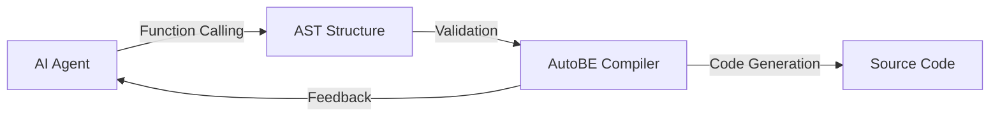
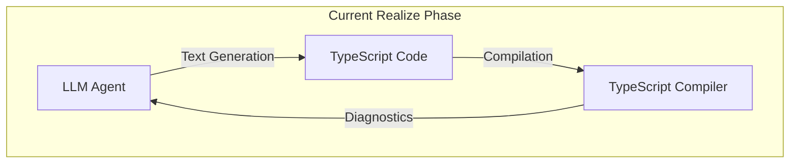
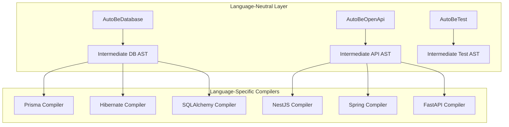

<!--
[AutoBE] Meet SunRabbit: The Compiler Expert Who's Accelerating Our AST-First Development and Multi-Language Vision
-->

## Preface

- Github Repository: https://github.com/wrtnlabs/autobe
- SunRabbit's GitHub: https://github.com/sunrabbit123

We are excited to announce that [SunRabbit (오병진)](https://github.com/sunrabbit123), a compiler expert who collaborated with [KDY1 (강동윤)](https://github.com/kdy1) on the [STC (Speedy TypeScript type Checker)](https://github.com/dudykr/stc) project, has joined the AutoBE team at Wrtn Technologies.

This is a significant milestone for AutoBE. While our core philosophy of "function calling AST structures through AI" has been established from the beginning, progress on the compiler and diagnoser development has been slower than expected due to a shortage of engineers with deep expertise in AST structures and compiler architecture. SunRabbit's arrival changes everything.

## Who is SunRabbit?

SunRabbit is a Seoul-based developer with extensive experience in compiler development and TypeScript tooling. His most notable achievement is his contribution to [STC](https://github.com/dudykr/stc), the Speedy TypeScript type Checker written in Rust that garnered 5.7k stars on GitHub.

STC was led by [KDY1](https://github.com/kdy1), the creator of [SWC (Speedy Web Compiler)](https://github.com/swc-project/swc) — one of the most influential projects in the JavaScript ecosystem with over 33k stars. KDY1 previously worked at Vercel and Deno, and SWC is now a core part of Next.js's build pipeline. SunRabbit's collaboration with KDY1 on STC gave him deep expertise in:

- TypeScript's type system internals
- Rust-based compiler development
- AST (Abstract Syntax Tree) manipulation
- Diagnostic generation and error reporting

These skills are exactly what AutoBE needs to advance our compiler-driven code generation system.

## Why This Matters for AutoBE

### The AST Journey So Far

AutoBE's architecture is fundamentally different from typical AI code generation tools. Instead of having AI generate code as raw text, we have AI construct AST structures through function calling, which our compilers then transform into valid source code.



This approach guarantees 100% compilation success because:
1. AST structures are inherently type-safe
2. Our compilers validate logical correctness before code generation
3. Diagnostic feedback guides AI agents to correct errors

However, building these systems requires specialized expertise. Here's where we stood before SunRabbit joined:

| Phase | AST Implementation | Status |
|-------|-------------------|--------|
| **Database** | `AutoBeDatabase.IApplication` | Complete |
| **Interface** | `AutoBeOpenApi.IDocument` | Complete |
| **Test** | `AutoBeTest.IFunction` | Partially Regressed |
| **Realize** | Partial AST | In Progress |

### The Test Phase Challenge

The Test phase tells an interesting story. We successfully built an AST structure (`AutoBeTest.IFunction`) and achieved working test generation through it. However, without dedicated compiler expertise on the team, maintaining and evolving this AST became challenging. We temporarily regressed to text-based generation while waiting for the right engineer.

```typescript
// AutoBeTest.IFunction - Our Test AST
export namespace AutoBeTest {
  export type IExpression =
    // LITERALS
    | IBooleanLiteral
    | INumericLiteral
    | IStringLiteral
    | IArrayLiteralExpression
    | IObjectLiteralExpression
    // ACCESSORS
    | IIdentifier
    | IPropertyAccessExpression
    | IElementAccessExpression
    // OPERATORS
    | IBinaryExpression
    | IPrefixUnaryExpression
    // FUNCTIONAL
    | ICallExpression
    | IArrayMapExpression
    | IArrayFilterExpression
    // PREDICATES
    | IEqualPredicate
    | IConditionalPredicate
    | IErrorPredicate;
    // ... and more
}
```

This AST covers everything needed to express E2E test functions: API calls, assertions, conditional logic, and random data generation. But converting arbitrary TypeScript constructs to this restricted AST format requires careful design and deep understanding of both TypeScript and compiler theory.

### The Realize Phase Opportunity

The Realize phase, which generates actual API implementation code, currently uses a hybrid approach with partial AST application. While the Database and Interface phases have complete AST coverage, the Realize phase generates business logic as text strings with compiler feedback loops for correction.



This works, but it doesn't leverage the full power of AST-driven development. With SunRabbit's compiler expertise, we aim to build a complete AST for the Realize phase as well.

## Multi-Language Vision: Beyond TypeScript

This is where SunRabbit's contribution becomes transformative.

### Current Stack: TypeScript + NestJS + Prisma

AutoBE currently generates backend applications exclusively for the TypeScript/NestJS/Prisma stack:

```
Requirements → Prisma Schema → OpenAPI Spec → NestJS Controllers → E2E Tests → Implementation
```

We chose TypeScript because:
- Open-source compiler with plugin system
- Strong type system for AI validation
- Excellent tooling ecosystem (Typia, Nestia, Prisma)

### The Multi-Language Challenge

However, the enterprise market demands diversity. Java/Spring dominates enterprise backends. Python/FastAPI is popular for AI/ML services. Go is chosen for high-performance microservices.

Our AST architecture has always been designed to be language-agnostic at the specification level:

- **AutoBeDatabase.IApplication**: Represents database schema abstractly — could compile to Prisma, Hibernate, SQLAlchemy, or GORM
- **AutoBeOpenApi.IDocument**: Standard OpenAPI representation — can generate SDKs and controllers in any language

But the Test and Realize phases are deeply coupled to TypeScript semantics:

```typescript
// TypeScript-specific expression types
export interface IArrowFunction {
  type: "arrowFunction";
  parameters: IParameter[];
  body: IStatement[] | IExpression;
}

// TypeScript-specific call patterns
export interface ICallExpression {
  type: "callExpression";
  expression: IExpression;
  arguments: IExpression[];
}
```

To support Java/Spring, we need:
- Java-specific AST expression types
- JUnit/TestContainers test generation
- Spring Boot controller patterns
- Maven/Gradle build integration

### SunRabbit's Multi-Language Initiative

SunRabbit is now leading the effort to make AutoBE's compilers and AST structures language-neutral. This involves:

1. **Abstract Expression Layer**: Creating a language-agnostic intermediate representation that can lower to TypeScript, Java, Python, or Go

2. **Pluggable Compiler System**: Defining clear interfaces so language-specific compilers can be developed independently

3. **Universal Test AST**: Designing test expression types that map to assertion frameworks across languages (Jest → JUnit → pytest → testing)



This is ambitious work that requires exactly the kind of compiler expertise SunRabbit brings from his STC collaboration with KDY1.

## What's Coming

With SunRabbit on the team, here's our updated roadmap:

### Short-term (Current Sprint)
- Revive and stabilize the Test phase AST (`AutoBeTest.IFunction`)
- Improve diagnostic generation for better AI feedback loops
- Complete the Realize phase compiler integration

### Medium-term (Q1-Q2 2026)
- Design language-agnostic intermediate representation
- Begin Java/Spring compiler prototype
- Enhance validation diagnosers with richer error information

### Long-term (2026)
- Full multi-language support (Java, Python, Go)
- Community-contributed language compilers
- IDE plugin with real-time AST visualization

## Join the Journey

AutoBE is an open-source project, and we welcome contributors who share our vision of compiler-driven AI code generation.

If you're interested in:
- Compiler development and AST design
- AI agent systems and function calling
- Multi-language code generation
- TypeScript tooling and Rust

...we'd love to have you join us.

- **GitHub**: https://github.com/wrtnlabs/autobe
- **Discord**: https://discord.gg/aMhRmzkqCx
- **Documentation**: https://autobe.dev/docs/

## Conclusion

SunRabbit's addition to the AutoBE team represents more than just a new hire — it's the catalyst for our next evolution. His deep compiler expertise, honed through collaboration with KDY1 on STC, gives us the capability to fully realize our AST-first vision and expand beyond TypeScript to support the diverse backend ecosystem.

The road from "AI generates text that might compile" to "AI constructs ASTs that are guaranteed to compile" has been challenging. With SunRabbit leading our compiler development, we're confident that AutoBE will deliver on its promise: 100% compilation success, across multiple languages and frameworks.

Stay tuned for visible results this year. The future of AI-powered backend generation is being built, one AST node at a time.

---

**About AutoBE**: AutoBE is an open-source vibe coding agent developed by Wrtn Technologies that automatically generates production-ready backend applications from natural language requirements. Through our proprietary compiler system, we achieve 100% compilation success by having AI construct AST structures through function calling, which our compilers validate and transform into source code.

https://github.com/wrtnlabs/autobe
