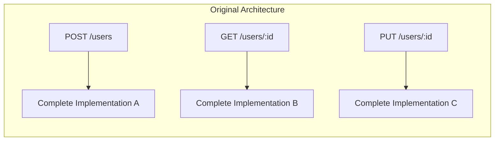
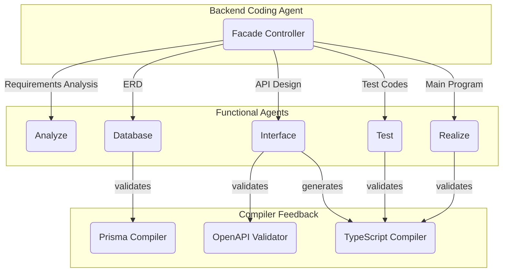
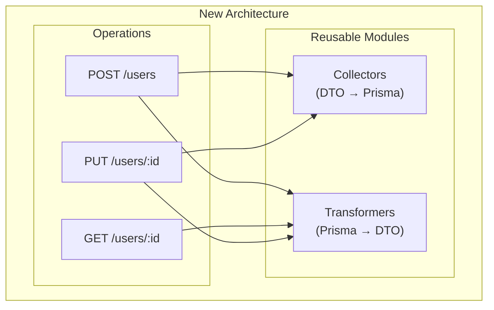

<!--
[AutoBe] We Built an AI That Writes Full Backend Apps — Then Broke Its 100% Success Rate on Purpose with Weak Local LLMs
-->

## TL;DR


- GitHub Repository: https://github.com/wrtnlabs/autobe
- Generated Examples: https://github.com/wrtnlabs/autobe-examples

[`AutoBe`](https://github.com/wrtnlabs/autobe) is an open-source AI agent that generates complete backend applications (TypeScript + NestJS + Prisma) from natural language.

- We adopted Korean SI methodology (no code reuse) and hit 100% compilation + near-100% runtime success
- Real-world use exposed it as unmaintainable, so we rebuilt everything around modular code generation
- Success rate cratered to 40% — we clawed it back by:
  - **RAG optimization** for context management
  - **Stress-testing with weak local LLMs** (30B, 80B) to discover edge cases
  - **Killing the system prompt** — replacing prose instructions with strict function calling schemas and validation feedback
- A 6.75% raw function calling success rate becomes 100% through validation feedback alone
- With `GLM v5` (local LLM), we're back to 100% compilation success
- AutoBe is no longer a one-shot prototype builder — it now supports incremental feature addition, removal, and modification on completed projects
- Runtime success (E2E tests) has not recovered yet — that's next

## 1. The Original Success (And Its Hidden Problem)

We achieved 100% compilation success. Every generated application compiled without errors, every E2E test passed, every API returned correct results. By every metric, the system was perfect.

Then we threw it all away and rebuilt from scratch.

[`AutoBe`](https://github.com/wrtnlabs/autobe) is an open-source AI agent, developed by [Wrtn Technologies](https://wrtn.io), that generates production-ready backend applications from natural language. You describe what you need in a chat interface, and AutoBe produces a complete TypeScript + NestJS + Prisma codebase — database schema, API specification, E2E tests, and fully typed implementation code.

With `GLM v5` — a local LLM — we've clawed our way back to 100%. Smaller models aren't there yet. This is the story of why we broke it, and what it took to start recovering.

When we first built AutoBe, we looked at how Korean SI (System Integration) projects are developed — government SI, financial SI, healthcare SI.

Their methodology is strict waterfall, and it enforces one distinctive principle: **each API function and test function must be developed completely independently**.

This means:
- No shared utility functions
- No code reuse between API endpoints
- Every operation is self-contained



We considered this the most orthodox, battle-tested approach to backend development — and adopted it wholesale.

And it worked. We achieved **100% compilation success** and **near-100% runtime success** — meaning not only did every generated application compile without errors, but the E2E tests actually passed and the APIs returned correct results.

Each API had its own complete implementation. No dependencies. No shared code. The AI generated each function in isolation, and the compiler validated them independently.

[](https://github.com/wrtnlabs/autobe-example-bbs)


> Every API and test function was written independently. And it worked surprisingly well.

### 1.1. Why This Methodology Exists

The logic behind this approach isn't arbitrary. In Korean SI projects:

- **Separation of responsibility**: Each developer is accountable for their specific functions
- **Regulatory compliance**: Auditors need to trace exactly which code handles which data
- **Conservative stability**: Changing shared code risks cascading failures

I once reviewed code written by bank developers. They had a function to format numbers with thousand separators (e.g., 3,000,000) — duplicated identically across dozens of API endpoints.

From their perspective, this was correct: no shared dependencies means no shared risk.

### 1.2. The Real-World Problem

Then we tried to use AutoBe for actual commercial projects.

**Requirements changed.**

In a waterfall approach, changing requirements should be handled at the specification phase. But reality doesn't follow textbooks. Clients change their minds. Market conditions shift. What seemed like a final specification evolves.

And with our "no code reuse" architecture, every small change was amplified across the entire codebase.

> "Can you add a `created_by` field to track who created each record?"

Simple request. But with 50 endpoints that handle record creation, we had to regenerate 50 completely independent implementations. Each one needed the exact same change. Each one had to be validated independently.

**It was hell.**

But the deeper problem wasn't just the cost of changes — it was that AutoBe had no concept of maintenance at all. It was a **one-shot prototype builder**. You described what you wanted, it generated a complete application, and that was it.

Want to add a notification system three weeks later? Start over. Want to remove the comment feature? Start over. Want to change how user permissions work? Start over.

We had built an impressively thorough generation pipeline — requirements analysis, database design, API specification, E2E tests, implementation — but it produced disposable code.

In the real world, software is never finished. Requirements evolve continuously. An AI agent that can't evolve with them is a toy, not a tool.

We understood why SI development enforces these patterns. But we weren't building applications for 20-year maintenance cycles with teams of specialized maintainers.

We needed an agent that could **grow with a project** — and our architecture made that fundamentally impossible.



## 2. The Decision: Embrace Modularity

We made a radical choice: **rebuild AutoBe to generate modular, reusable code** — not just for cleaner output, but because modularity is the prerequisite for maintainability.

If the generated code has stable module boundaries, then adding a feature means generating new modules and updating affected ones. Not starting over.



The new architecture separates concerns into three layers:

1. **Collectors**: Transform request DTOs into Prisma create/update inputs
2. **Transformers**: Convert Prisma query results back to response DTOs
3. **Operations**: Orchestrate business logic using collectors and transformers

When requirements change, you update the collector or transformer once, and all dependent operations automatically get the fix.

### 2.1. The Immediate Consequence

**Compilation success dropped to under 40%.**

The moment we introduced code dependencies between modules, everything became harder:

- Circular dependency detection
- Import ordering validation
- Type inference across module boundaries
- Interface compatibility between generated modules

Our AI agents, optimized for isolated function generation, suddenly had to understand relationships. They had to know that one module's output is compatible with another module's input. They had to understand that interfaces between modules must match exactly.

The margin for error vanished.

The self-healing feedback loops we relied on — compiler diagnostics feeding back to AI agents — were overwhelmed by cascading errors. Fix one module, break three others.

## 3. The Road Back to 100%

We spent months rebuilding. Here's what it took.

### 3.1. RAG Optimization for Context Management

The first breakthrough was realizing our AI agents were drowning in context. With modular code, they needed to understand:
- The database schema
- All related collectors
- All related transformers
- The OpenAPI specification
- Business requirements

Passing all of this in every prompt was noisy. The AI couldn't find the relevant information in the sea of context.

Commercial models like GPT-4.1 or Claude could muscle through a bloated context window — their sheer capacity compensated for the noise. Local LLMs couldn't. A 30B model fed the entire specification would lose track of what it was generating and hallucinate wildly.

We implemented a hybrid RAG system combining vector embeddings (cosine similarity) with BM25 keyword matching. Now, when generating a module, the system retrieves only the relevant requirement sections — not the entire 100-page specification.

Local LLMs that previously failed on anything beyond a toy project started handling complex, multi-entity backends — the same tasks that used to require commercial API calls.

### 3.2. Stress-Testing with Intentionally Weak Models

AutoBe's core philosophy is not about making smarter prompts or more sophisticated orchestration — it's about hardening the schemas and feedback loops that surround the LLM.

The AI can hallucinate, misinterpret, or produce malformed output. Our job is to catch every failure mode and feed precise diagnostics back so the next attempt succeeds.

The question was: **how do you find edge cases you don't know exist?**

Our answer: use intentionally weak models as stress testers. A strong model like GPT-4.1 papers over ambiguities in your schemas — it guesses what you meant and gets it right. A weak model exposes every gap mercilessly.

We ran two local LLMs against the same generation tasks:

| Model | Success Rate | What It Exposed |
|-------|-------------|-----------------|
| `qwen3-30b-a3b-thinking` | ~10% | Fundamental AST schema ambiguities, malformed output structures, missing required fields |
| `qwen3-next-80b-a3b-instruct` | ~20% | Subtle type mismatches and edge cases that only surface in complex nested relationships |

The ~10% success rate with `qwen3-30b-a3b-thinking` was the most valuable result. Every failure pointed to a place where our AST schema was ambiguous, our compiler diagnostics were vague, or our validation logic had a blind spot.

Each fix didn't just help the weak model — it tightened the entire system. When a schema is precise enough that even a 30B model can't misinterpret it, a strong model will never get it wrong.

This is also why local LLMs matter for cost reasons: discovering these edge cases requires hundreds of generation-compile-diagnose cycles. At cloud API prices, that's prohibitive.

Running locally, we could iterate relentlessly until every failure mode was catalogued and addressed.

### 3.3. Killing the System Prompt

We made a counterintuitive decision: **minimize the system prompt to almost nothing**.

Most AI agent projects pour effort into elaborate system prompts — long, detailed instructions telling the model exactly how to behave. Inevitably, this leads to prohibition rules: "do NOT generate utility functions," "NEVER use `any` type," "do NOT create circular dependencies."

The problem is that prohibition rules often backfire. When you tell a language model "do not do X," you're placing X front and center in its attention. The model now has to represent the forbidden pattern to avoid it — and in practice, this increases the probability of producing exactly what you prohibited.

It's the "don't think of a pink elephant" problem, baked into token prediction.

We went the opposite direction. To build an agent that works consistently across different LLMs, we stripped the system prompt down to bare essentials: only the minimum rules and principles, stated with maximum clarity and brevity. No verbose explanations. No prohibition lists.

Instead, we moved the "prompting" into two places where ambiguity doesn't survive — and where prohibition rules simply aren't needed:

**1. Function calling schemas** — strict type definitions with precise annotations on every type and property. A JSON Schema with a well-named field and a clear description is unambiguous in a way that natural language instructions never are.

AutoBe defines dedicated AST types for every generation phase. The AI doesn't produce raw code — it fills in typed structures that our compilers convert to code:

- [Database schema AST](https://github.com/wrtnlabs/autobe/blob/main/packages/interface/src/database/AutoBeDatabase.ts) — Prisma models, fields, relations, indexes
- [API specification AST](https://github.com/wrtnlabs/autobe/blob/main/packages/interface/src/openapi/AutoBeOpenApi.ts) — OpenAPI schemas, endpoints, DTOs
- [Test function AST](https://github.com/wrtnlabs/autobe/blob/main/packages/interface/src/test/AutoBeTest.ts) — E2E test expressions, assertions, random generators

```typescript
// DTO types: the AI defines request/response schemas from a closed set of AST nodes
export namespace AutoBeOpenApi {
  export type IJsonSchema =
    | IJsonSchema.IConstant
    | IJsonSchema.IBoolean
    | IJsonSchema.IInteger
    | IJsonSchema.INumber
    | IJsonSchema.IString
    | IJsonSchema.IArray
    | IJsonSchema.IObject
    | IJsonSchema.IReference
    | IJsonSchema.IOneOf
    | IJsonSchema.INull;
}

// Test functions: 30+ expression types forming a complete test DSL
export namespace AutoBeTest {
  export type IExpression =
    | IBooleanLiteral   | INumericLiteral    | IStringLiteral
    | IArrayLiteralExpression   | IObjectLiteralExpression
    | ICallExpression   | IArrowFunction     | IBinaryExpression
    | IArrayMapExpression       | IArrayFilterExpression
    | IFormatRandom     | IPatternRandom     | IIntegerRandom
    | IEqualPredicate   | IConditionalPredicate
    | ...  // 30+ variants in total
}
```

Every variant is a discriminated union with annotated properties. The model can't produce an invalid shape — the type system physically prevents it, and validation catches anything that slips through.

**2. Validation feedback messages** — when the compiler catches an error, the diagnostic message itself becomes the guide. Each message is crafted to tell the model exactly what went wrong and what the correct form looks like.

To put this in perspective: `qwen3-coder-next`'s raw function calling success rate for DTO schema generation is just **15%** on a Reddit-scale project. For a shopping mall backend, where the project is larger and more complex, that drops to **6.75%**.

That means roughly 93 out of 100 function calls produce invalid output.

Yet the interface phase finishes with **100% success**. Every single DTO schema is generated correctly.

Validation feedback turns a 6.75% raw success rate into 100% — not 92%, not 96%, but 100%. Every failed call gets a structured diagnostic — exact file, exact field, exact problem — and the model corrects itself on the next attempt.

This is the loop we hardened by stress-testing with local LLMs: every edge case we discovered became a more precise feedback message, and every more precise message pushed the correction rate higher.


> Qwen3-Coder-Next's function calling success rate for constructing DTO schema drops as low as **6.75%**. Yet validation feedback turns that abysmal 6.75% into a **100% completion** rate.

You could say the system prompt didn't disappear — it migrated from free-form text into schemas and feedback loops.

The result surprised us. When instructions live in type definitions and validation messages rather than prose, **model variance nearly vanishes**.

We didn't need to write different prompts for different models. A type is a type. A schema is a schema. Every model reads them the same way.

How strong is this effect? On more than one occasion, we accidentally shipped agent builds with the system prompt completely missing — no instructions at all, just the bare function calling schemas and validation logic.

**Nobody noticed.** The output quality was indistinguishable.

That's when we knew: types and schemas turned out to be the best prompt we ever wrote, and validation feedback turned out to be better guidance than any orchestration logic.

## 4. The Results

After months of work, here's where we stand — local LLMs only.

Every model passes all prior phases (requirements analysis, database schema, API specification, E2E tests) with 100% success. The only remaining errors occur in the final realize phase, where the generated code must compile. The scores below show the compilation success rate (error-free functions / total generated functions):

<sub>Model</sub> \ <sup>Backend</sup> | `todo` | `bbs` | `reddit` | `shopping`
--------------------------------------|--------|-------|----------|------------
`z-ai/glm-5`                          | ✅ 100 | ✅ 100 | ✅ 100  | ✅ 100
`deepseek/deepseek-v3.1-terminus-exacto` | ✅ 100 | 🔴 87 | 🟢 99  | ✅ 100
`qwen/qwen3-coder-next`               | ✅ 100 | ✅ 100 | 🟡 96   | 🟡 92
`qwen/qwen3-next-80b-a3b-instruct`    | 🟡 95  | 🟡 94  | 🔴 88   | 🟡 91
`qwen/qwen3-30b-a3b-thinking`         | 🟡 96  | 🟡 90  | 🔴 71   | 🔴 79

To be honest: **runtime success has not recovered yet.** The original architecture achieved near-100% E2E test pass rates. With the new modular architecture, we're not there.

Compilation is a necessary condition, not a sufficient one — code that compiles doesn't guarantee correct business logic. Runtime recovery is our next frontier.

But more importantly, the generated code is now **maintainable**:

```typescript
// Before: 50 endpoints × duplicated logic
// After: 1 collector, 1 transformer, 50 thin operations

// When requirements change:
// Before: Modify 50 files
// After: Modify 1 file
```

### 4.1. Developer Experience

We felt the difference firsthand when building an administrative organization management system. Requirements changed constantly — not just field additions, but structural changes.

The client restructured the entire department hierarchy from a flat list to a tree. Then they bolted on a multi-level approval workflow that cut across departments. Then they changed permission scopes from role-based to position-based — twice.

With the old architecture, each of those changes would have meant regenerating the entire application from scratch.

With the modular architecture, restructuring the department hierarchy meant regenerating only the modules responsible for department data — every API that consumed them just worked with the updated structure. Adding the approval workflow meant generating new modules without touching existing ones.

The system grew incrementally instead of being rebuilt from zero each time.

### 4.2. From Prototype Builder to Living Project

There's another result that doesn't show up in the benchmark table.

Remember the core problem from Section 1: the old AutoBe was a one-shot prototype builder. Generation was impressive, but the moment you needed to change anything, you started over. That made AutoBe a demo, not a development tool.

With the modular architecture, that limitation is gone. AutoBe now supports **incremental development** on completed projects:

- **Add a feature**: "Add a notification system" → AutoBe generates new notification collectors, transformers, and operations. Existing user, article, and comment modules stay untouched.
- **Remove a feature**: "Remove the comment system" → AutoBe removes comment-related modules and updates the operations that referenced them. Everything else remains intact.
- **Modify behavior**: "Change permissions from role-based to attribute-based" → AutoBe regenerates the permission modules and the operations that depend on them. The rest of the codebase is unaffected.

This is possible because the generated modules form **stable boundaries**. Each module has a well-defined interface.

When requirements evolve, AutoBe identifies which modules are affected, regenerates only those, and validates that the updated modules still integrate correctly with the rest.

The old AutoBe generated code. The new AutoBe **maintains** code. That's the difference between a toy and a tool.

## 5. Lessons Learned

### 5.1. Success Metrics Can Mislead

We had 100% compilation success. By every metric, the system was working. But metrics don't capture maintainability. They don't measure how painful it is to change things.

The willingness to sacrifice a "perfect" metric to solve a real problem was the hardest decision.

### 5.2. Weak Models Are Your Best QA Engineers

Not for production — but for hardening your system. A strong model compensates for your mistakes. A weak model refuses to. Every edge case we discovered with `qwen3-30b-a3b-thinking` was a gap in our schemas or validation logic that would have silently degraded output quality for all models.

If you're building an AI agent, test it with the worst model you can find.

### 5.3. Types Beat Prose

We spent months perfecting system prompts. Then we stripped them to almost nothing and moved the instructions into function calling schemas and validation feedback messages.

The result was better — and model-agnostic. Natural language is ambiguous. Types are not. If you can express a constraint as a type, don't express it as a sentence.

### 5.4. RAG Isn't Just About Retrieval

Our RAG system doesn't just retrieve documents. It curates context. The AI needs to see the right information at the right time, not everything all at once.

### 5.5. Modularity Compounds

The short-term cost of modularity (40% success rate, months of rebuilding) was high. But modularity compounds. Each improvement to our compilers, our schemas, our validation logic benefits every module generated from now on.

## 6. What's Next

We're not done. Current goals:

- **100% runtime success**: Compilation success doesn't guarantee business logic correctness. Runtime recovery is our top priority.
- **Multi-language support**: The modular architecture makes this feasible. Collectors and transformers can compile to different target languages.
- **Incremental regeneration**: Only regenerate modules affected by requirement changes, not the entire codebase.

## 7. Conclusion

The journey from 100% → 40% → and climbing back taught us something important: **the right architecture matters more than the right numbers**.

We could have kept our original success rates. The code would compile. The tests would pass. But every requirement change would be painful, and the generated code would remain disposable — use once, throw away, regenerate from scratch.

The rebuild cost us months and a perfect scorecard.

What it gave us was stronger schemas, model-agnostic validation loops, and an architecture where the agent can grow with a project instead of starting over every time.

We're not at 100% across all models yet. But the gap is small, the trajectory is clear, and every fix we make to our schemas and validation logic closes it for every model at once.

That's the power of building on types instead of prompts.

Sometimes you have to break what works to build what's actually useful.

In the next article, we'll break down exactly how validation feedback turns a 6.75% raw success rate into 100% — how to design function calling schemas for structures as complex as a compiler's AST with 30+ node types, and how to build the feedback loops that make even weak models self-correct.

We'll make it practical enough that you can apply it to your own AI agents.

---

**About AutoBe**: AutoBe is an open-source AI agent developed by Wrtn Technologies that generates production-ready backend applications from natural language.

Through strict type schemas, compiler-driven validation, and modular code generation, we're pushing compilation success toward 100% across all models — while producing maintainable, production-ready code.

https://github.com/wrtnlabs/autobe
