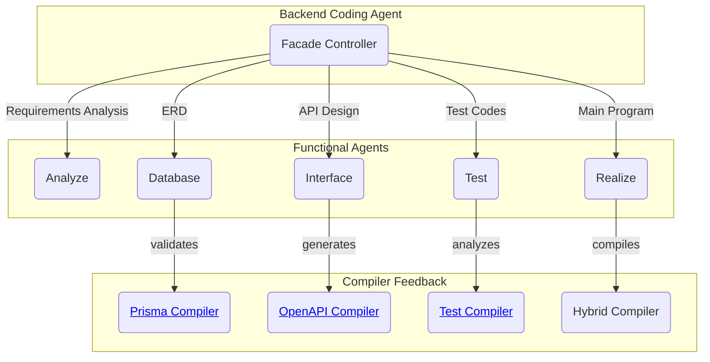
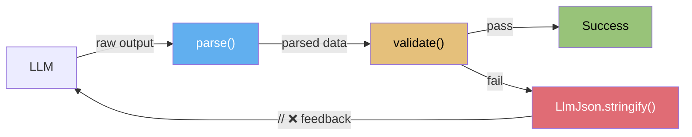

import AutoBeDemoMovie from "../../movies/demo/AutoBeDemoMovie";
import { BenchmarkDashboard } from "../../components/benchmark/BenchmarkDashboard";

> **TL;DR**
>
> 1. Claude Code—source code leaked via an npm incident
>    - `while(true)` + autonomous selection of 40 tools + 4-tier context compression
>    - A masterclass in prompt engineering and agent workflow design
>    - 2nd generation: humans lead, AI assists
> 2. [AutoBe](https://github.com/wrtnlabs/autobe)—the opposite design
>    - 4 ASTs x 4-stage compiler x self-correction loops
>    - Function Calling Harness: even small models produce backends on par with top-tier models
>    - 3rd generation: AI generates, compilers verify
> 3. After reading—shared insights, a coexisting future
>    - Independently reaching the same conclusions: reduce the choices; give workers self-contained context
>    - 0.95^400 ~ 0%—the shift to 3rd generation is an architecture problem, not a model performance problem
>    - AutoBE handles the initial build, Claude Code handles maintenance—coexistence, not replacement
>
> **Recommended reading**: [Function Calling Harness](/blog/function-calling-harness-qwen-meetup-korea)—a deep dive into the technique that turned 6.75% into 100%

# AutoBE vs. Claude Code

## 1. The Incident

April 2026. A screenshot started circulating through developer communities. An Anthropic engineer had run `npm publish` without a `.npmignore`, and Claude Code's entire source code had been uploaded to the npm registry.

**512,000 lines. 1,900 files.** The complete internal architecture of the world's most widely used AI coding agent, exposed by a single missing configuration file.

Anthropic took the package down within hours, but by then countless developers had already downloaded the source. Reddit, Hacker News, X—timelines were flooded with Claude Code source analysis. Some shared the system prompts. Others dissected the security architecture. Others mapped out the structure of the `while(true)` loop.

We cleared our schedules—we had no choice.

AutoBE was at an **inflection point**. We were about to layer serious orchestration on top of a pipeline we had intentionally kept simple (more on this in Section 3). We needed to study how other AI agents designed their orchestration.

Then Anthropic's packaging mistake handed us the reference architecture. It couldn't have come at a better time—felt like receiving a gift.

Claude Code was deeper than we expected—not just a large project, but **an entire worldview**. Seven recovery paths inside a `while(true)` loop. Four-tier context compression. Twenty-three security check categories. Over 400KB of security code for BashTool alone.

The deeper we dug, the clearer it became **why we built things differently**.

This post is those reading notes.

## 2. What is AutoBE

<AutoBeDemoMovie model="qwen/qwen3.5-35b-a3b" />

[AutoBe](https://github.com/wrtnlabs/autobe) is an open-source AI agent that automatically generates backends. Say "build me a shopping mall backend," and it produces everything from requirements analysis to database design, API specification, E2E tests, and NestJS implementation code—all at once.

Because Function Calling Harness and AI-native compilers uniformly guarantee the quality of generated output, even small models like `qwen3.5-35b-a3b` can produce backends on par with top-tier models—at a fraction of the cost.

> Currently supports the TypeScript / NestJS / Prisma stack.
>
> Expansion to other languages and frameworks begins in July 2026.

### 2.1. The LLM Doesn't Write Code

Most AI coding agents tell the LLM "write this code" and save the returned text to a file. AutoBE is different.

AutoBE uses **Function Calling**. Instead of free-form text, the LLM fills in a predefined JSON Schema—an AST (Abstract Syntax Tree). It's not writing on a blank page; it's filling in a form. Once the form is filled, a compiler validates it and transforms it into actual code. **The LLM fills in the structure; the compiler writes the code.**

This principle applies across the entire 5-stage pipeline:

| Stage          | Structure the LLM fills | Compiler validation |
|----------------|-------------------------|---------------------|
| Requirements   | [`AutoBeAnalyze`](https://github.com/wrtnlabs/autobe/blob/main/packages/interface/src/analyze/AutoBeAnalyze.ts)—structured SRS | Structure validation |
| DB Design      | [`AutoBeDatabase`](https://github.com/wrtnlabs/autobe/blob/main/packages/interface/src/database/AutoBeDatabase.ts)—DB schema AST | Database Compiler |
| API Design     | [`AutoBeOpenApi`](https://github.com/wrtnlabs/autobe/blob/main/packages/interface/src/openapi/AutoBeOpenApi.ts)—OpenAPI v3.2 spec | OpenAPI Compiler |
| Testing        | [`AutoBeTest`](https://github.com/wrtnlabs/autobe/blob/main/packages/interface/src/test/AutoBeTest.ts)—30+ expression types | Test Compiler |
| Implementation | Modularized code (Collector/Transformer/Operation) | Hybrid Compiler |

Each AST strictly constrains what the LLM can generate. For example, `AutoBeDatabase` allows only 7 field types: `"boolean" | "int" | "double" | "string" | "uri" | "uuid" | "datetime"`. You can't use `"varchar"`—it simply isn't an option. **The schema is the prompt**—unambiguous, model-independent, and mechanically verifiable.



### 2.2. Why Function Calling

"Can't you just have the LLM write text code directly?"

For frontend, maybe. If a button is slightly misplaced or an animation feels off, the app still works. On mobile, you can patch after launch. But **backends are different.**

Backend development isn't a domain of creativity—**it's a domain of logic and precision.** If a single API returns the wrong type, every client breaks. If one foreign key is missing, data integrity is gone. If two APIs define the same entity differently, the system is internally contradictory. A frontend bug is an inconvenience; a backend bug is an outage—the backend is the single source of truth that every client depends on. **Consistency and 100% correctness are non-negotiable prerequisites**, not nice-to-haves.

Free-form text generation cannot structurally meet this requirement.

#### 2.2.1. Uncontrollable

Can you enforce consistency through prompts? "Don't use varchar," "don't use `any` types," "don't create utility functions"—this is the [pink elephant problem](/blog/function-calling-harness-qwen-meetup-korea). Tell someone "don't think of a pink elephant," and the first thing they do is picture one. Tell an LLM "don't do X," and X lands at the center of attention, actually *increasing* the probability of generating it. Natural language can only express constraints through prohibition, and **prohibition is structurally incomplete.**

```typescript
export namespace AutoBeDatabase {
  export interface IForeignField {
    name: string & SnakeCasePattern; // enforce snake_case naming
    type: "uuid";
    relation: IRelation;
    unique: boolean;
    nullable: boolean;
  }
  export interface IPlainField {
    name: string & SnakeCasePattern;
    type: // restrict type by spec, not by prohibition rule
      | "boolean"
      | "int"
      | "double"
      | "string"
      | "uri"
      | "uuid"
      | "datetime";
    description: string;
    nullable: boolean;
  }
}
```

Function Calling solves this at the root. The LLM isn't writing on a blank page—it's filling in a predefined form. There are only 7 field types; API specs follow the OpenAPI v3.2 schema; test logic can only be expressed within 30 variants of `IExpression`. It's not "don't use varchar"—varchar simply doesn't exist as an option. **Not prohibition, but absence.** Communicate through types and there's no misunderstanding; constrain through schemas and there's no pink elephant.

#### 2.2.2. The Compound Effect

The math of backends is unforgiving. Consider a service with 50 tables and 400 APIs. All 400 APIs must succeed for the server to run. Total success rate = (per-unit success rate)^n:

At 95%, even 50 APIs make it virtually impossible. At 99%, 400 APIs still yield only 1.8%. Only **100% survives.**

| Per-unit success rate | 10 APIs | 50 APIs | 100 APIs | 400 APIs |
|:---:|:---:|:---:|:---:|:---:|
| 95% | 59.9% | 7.7% | 0.6% | ~ 0% |
| 99% | 90.4% | 60.5% | 36.6% | 1.8% |
| 99.9% | 99.0% | 95.1% | 90.5% | 67.0% |
| **100%** | **100%** | **100%** | **100%** | **100%** |

This is the structural limitation of free-form text generation. Hand a coding assistant a backend with 50 tables and 400 APIs, and you'll get output. **0 to 80 is fast.** The scaffolding is great, individual functions are well-written. But getting 400 APIs to be mutually consistent, with every FK properly connected and shared types uniform across all endpoints—that's **80 to 100**, a region that free-form text generation structurally cannot reach. As long as each API's success rate is 95%, total success converges to 0 as the API count grows. A human could review all 400 one by one, but then what's the point of AI?

Function Calling fundamentally solves this compound problem. The form is fixed, so variance is zero; a compiler validates the form, so per-unit success rate converges to 100%. **1.0<sup>400</sup> = 1.0.** On top of that, a 4-stage compiler guarantees system-level consistency—cross-validation between DB schema and API spec, uniformity of shared types across APIs, detection of circular dependencies between modules. If validation fails, a self-correction loop repeats until it passes.

#### 2.2.3. Variance

LLM output is a sample drawn from a probability distribution. Run the same model with the same prompt and you get different code every time—different variable names, different patterns, different error handling approaches. Swap the model and the differences grow larger. Claude leans functional, GPT leans class-based, Qwen has its own idioms. This variance is richness in creative writing, but a defect in backends.

When the form is fixed, variance vanishes. The AST schema uniformly governs the model's "style," and the compiler verifies the result, so the model's personality has minimal impact on the final output. The [benchmarks](/benchmark) prove this:

<BenchmarkDashboard />

The backends generated by `qwen3.5-35b-a3b` (3B active) and `claude-sonnet-4.6` have nearly identical architecture, module structure, and naming conventions. Strong models converge in 1-2 iterations; weaker models converge in 3-4—but the destination is the same. **Different models, same result. Run it again, same result.** This is the consistency that backends demand, and Function Calling is the only approach that can structurally guarantee it.

### 2.3. Industry Consensus: "That Won't Work"

But the forms the LLM must fill are far from simple. [`AutoBeOpenApi.IJsonSchema`](https://github.com/wrtnlabs/autobe/blob/main/packages/interface/src/interface/AutoBeOpenApi.ts), which defines DTO types, is a recursive union type with 10 variants:

```typescript
export type IJsonSchema =
  | IJsonSchema.IBoolean
  | IJsonSchema.IInteger
  | IJsonSchema.INumber
  | IJsonSchema.IString
  | IJsonSchema.IArray      // items: IJsonSchema <- recursive
  | IJsonSchema.IObject     // properties: Record<string, IJsonSchema> <- recursive
  | IJsonSchema.IReference
  | IJsonSchema.IOneOf      // oneOf: IJsonSchema[] <- recursive
  | IJsonSchema.INull
  | IJsonSchema.IConstant;
```

Ten variants nested 3 levels deep yield 1,000 possible paths.

The test stage is even more complex. [`AutoBeTest.IExpression`](https://github.com/wrtnlabs/autobe/blob/main/packages/interface/src/test/AutoBeTest.ts), which represents E2E test logic, has **over 30 recursive variants**—programming-language-level complexity packed into a single Function Call:

```typescript
export type IExpression =
  | IBooleanLiteral   | INumericLiteral    | IStringLiteral     // literals
  | IArrayLiteralExpression  | IObjectLiteralExpression          // compound literals
  | INullLiteral      | IUndefinedKeyword                       // null/undefined
  | IIdentifier       | IPropertyAccessExpression               // accessors
  | IElementAccessExpression | ITypeOfExpression                 // access/operations
  | IPrefixUnaryExpression   | IPostfixUnaryExpression           // unary operations
  | IBinaryExpression                                            // binary operations
  | IArrowFunction    | ICallExpression    | INewExpression      // functions
  | IArrayFilterExpression   | IArrayForEachExpression           // array operations
  | IArrayMapExpression      | IArrayRepeatExpression            // array operations
  | IPickRandom       | ISampleRandom      | IBooleanRandom     // random generation
  | IIntegerRandom    | INumberRandom      | IStringRandom      // random generation
  | IPatternRandom    | IFormatRandom      | IKeywordRandom     // random generation
  | IEqualPredicate   | INotEqualPredicate                      // assertions
  | IConditionalPredicate    | IErrorPredicate;                  // assertions
```

This is the actual complexity of the form the LLM must accurately fill in a single Function Call.

`qwen3-coder-next`'s first-attempt success rate on `IJsonSchema`: **6.75%**. The industry consensus is clear—[NESTFUL (EMNLP 2025)](https://arxiv.org/abs/2409.03797) measured GPT-4o's nested tool calling accuracy at 28%, and [JSONSchemaBench (ICLR 2025)](https://arxiv.org/abs/2501.10868) reported success rates of 3-41% on the hardest tier across 10,000 real-world schemas. BoundaryML went further, arguing that structured output actually [degrades a model's reasoning ability](https://boundaryml.com/blog/structured-outputs-create-false-confidence). The consensus: **don't do Function Calling with complex schemas.**

We couldn't give up. Without structured output, mechanical verification is impossible; without verification, feedback loops are impossible; without feedback loops, guarantees are impossible.

So we built the [Function Calling Harness](/blog/function-calling-harness-qwen-meetup-korea). [Typia](https://github.com/samchon/typia)'s 3-tier infrastructure is at its core:



All three tiers are auto-generated by [Typia](https://github.com/samchon/typia)'s compiler from TypeScript type definitions. Developers only need to define TypeScript types—the Function Calling schema, `parse()` recovery logic, `validate()` checker, and `LlmJson.stringify()` feedback generator all derive from the same type. **A single type governs schema, parsing, validation, and feedback simultaneously.**

#### 2.3.1. `parse()` — Recovering Broken JSON

LLMs aren't JSON generators. They wrap output in markdown code blocks, prepend "I'd be happy to help!", leave brackets unclosed, omit quotes on keys, and write `tru` instead of `true`. The Qwen 3.5 series is worse—it double-serializes every union type field with **100% probability**. A real production response that contained 7 simultaneous issues:

```typescript
import { dedent } from "@typia/utils";
import typia, { ILlmApplication, ILlmFunction, tags } from "typia";

const app: ILlmApplication = typia.llm.application<OrderService>();
const func: ILlmFunction = app.functions[0];

// LLM sometimes returns malformed JSON with wrong types
const llmOutput = dedent`
  > LLM sometimes returns some prefix text with markdown JSON code block.

  I'd be happy to help you with your order! 😊

  \`\`\`json
  {
    "order": {
      "payment": "{\\"type\\":\\"card\\",\\"cardNumber\\":\\"1234-5678", // unclosed string & bracket
      "product": {
        name: "Laptop", // unquoted key
        price: "1299.99", // wrong type (string instead of number)
        quantity: 2, // trailing comma
      },
      "customer": {
        // incomplete keyword + unclosed brackets
        "name": "John Doe",
        "email": "john@example.com",
        vip: tru
  \`\`\` `;

const result = func.parse(llmOutput);
if (result.success) console.log(result);

interface IOrder {
  payment: IPayment;
  product: {
    name: string;
    price: number & tags.Minimum<0>;
    quantity: number & tags.Type<"uint32">;
  };
  customer: {
    name: string;
    email: string & tags.Format<"email">;
    vip: boolean;
  };
}

type IPayment =
  | { type: "card"; cardNumber: string }
  | { type: "bank"; accountNumber: string };

declare class OrderService {
  /**
   * Create a new order.
   *
   * @param props Order properties
   */
  createOrder(props: { order: IOrder }): { id: string };
}
```

A single call to `func.parse()` recovers all 7 issues:

- **Markdown block & prefix chatter** -> stripped
- **Unclosed string & bracket** (`"1234-5678`) -> auto-completed
- **Unquoted key** (`name:`) -> accepted
- **Trailing comma** (`quantity: 2,`) -> ignored
- **Incomplete keyword** (`tru`) -> completed to `true`
- **Wrong type** (`"1299.99"`) -> coerced to `1299.99` according to the schema
- **Double serialization** (`"{\"type\":\"card\"...`) -> recursively restored to object

#### 2.3.2. `validate()` + `LlmJson.stringify()` — Precision Feedback

Even after parsing, the values themselves can be wrong. Negative prices, non-email strings, decimals where integers are expected. When `validate()` detects a schema violation, `LlmJson.stringify()` generates inline `// ❌` error markers on top of the LLM's original JSON:

```json
{
  "order": {
    "payment": {
      "type": "card",
      "cardNumber": 12345678 // ❌ [{"path":"$input.order.payment.cardNumber","expected":"string"}]
    },
    "product": {
      "name": "Laptop",
      "price": -100, // ❌ [{"path":"$input.order.product.price","expected":"number & Minimum<0>"}]
      "quantity": 2.5 // ❌ [{"path":"$input.order.product.quantity","expected":"number & Type<\"uint32\">"}]
    },
    "customer": {
      "name": "John Doe",
      "email": "invalid-email", // ❌ [{"path":"$input.order.customer.email","expected":"string & Format<\"email\">"}]
      "vip": "yes" // ❌ [{"path":"$input.order.customer.vip","expected":"boolean"}]
    }
  }
}
```

The LLM only needs to fix the errors marked on its own output—no need to rewrite everything, just fix the 5 flagged fields. **Precise, structured, and immediately actionable feedback.**

This loop is what turns 6.75% into 100%. On top of that, AutoBE's 4-stage compiler (Database -> OpenAPI -> Test -> TypeScript) adds system-level self-correction loops. **Dual validation at the Function Calling level and the compiler level** is what drives 100% compilation success.

## 3. Why This Moment

### 3.1. Intentionally Kept Simple

AutoBE had never paid close attention to agent orchestration. **Intentionally.**

We kept the workflow in its simplest possible form: one-directional waterfall, one round of AI self-review, one shot at code generation. We also intentionally **banned large models**, running repeated experiments with small ones (`qwen3-30b-a3b`, 3B active). Three reasons.

#### 3.1.1. Stability

We needed to measure each pipeline stage's success rate in isolation. Complex orchestration makes it difficult to identify which stage failed. In a simple pipeline, "FK references broke in the Database stage" is clear. In complex orchestration, it becomes "something went wrong somewhere."

#### 3.1.2. Debugging

The more stages where AI intervenes autonomously, the exponentially harder it becomes to trace failure causes. When Agent A corrects something, Agent B touches it again, and Agent C modifies that result—the root cause gets buried.

#### 3.1.3. Preventing Weakness Concealment

Smart AI and sophisticated workflows **mask the system's vulnerabilities**. If the Database stage generates a flawed schema but the subsequent Interface stage's AI silently compensates, you never discover the Database stage's weakness. Vulnerabilities exposed by small models also exist in large models—they just surface less often. "Less often" becomes "occasionally" in production, and "occasionally" becomes an outage.

So we deliberately—with small models, in a simple pipeline, with minimal AI intervention—tightened only the validation at each stage.

### 3.2. Breaking 100% and Rebuilding

[We had previously achieved 100% compilation + runtime success rate](/blog/autobe-broke-100-percent-success-rate-on-purpose). Then we deliberately broke it to rebuild at a higher level of quality.

#### 3.2.1. Divide and Conquer

AutoBE's first goal was simple: generate each API function independently. No code reuse, no inter-function dependencies, each function self-contained. If 10 functions query the same table, all 10 contain the same duplicated query.

You can't run before you walk. We first needed to prove, in the simplest possible form, that the Function Calling Harness worked, that the compiler feedback loop achieved self-correction, and that 100% was reachable even with small models.

And we proved it. 100% compilation, 100% runtime. Even with small models. **The foundation works.**

#### 3.2.2. The Output Wasn't Software

After hitting 100% compilation and runtime, we looked at the output. It compiled and ran—but it **wasn't maintainable software.** Adding a column to a table meant regenerating all 10 related functions. Changing requirements meant rebuilding from scratch. Without code reuse, the output could be generated but couldn't evolve.

The next mission was clear: move to a **structure that enables code reuse**—where functions call other functions, shared logic converges in one place, and requirement changes only require modifying what changed.

#### 3.2.3. Breaking It

So we broke 100%.

Introducing inter-module dependencies caused the success rate to **plummet to 40%**. Problems that didn't exist with independent functions erupted all at once—the moment functions call each other, one function's mistake breaks another. Return types don't match, imports get tangled, dependency ordering falls apart. A microcosm of the **compound effect** from Section 2.2—when 100 modules depend on each other, each module's 95% success rate converges to 0% at the system level.

From 100% to 40%. It took months. We strengthened the compiler, refined the correction loops, and improved the Harness.

We reached 100% compilation again. Runtime 100% is still being restored.

### 3.3. Time to Get Sophisticated

At this point, we had fully achieved 100% compilation. Runtime 100% was still in progress.

This is when we declared:

> "With 100% compilation secured as our foundation, it's time to start getting sophisticated."

Introduce agent self-review loops. Refine the prompts. Add sophistication to the orchestration. **No matter how sophisticated you make a workflow without a verification foundation, it's nothing more than an elaborate dice roll.** Lay the verification foundation first, then build the workflow on top—we were convinced this was the right order.

To do that, we needed to **seriously study how other AI agents designed their orchestration**.

That's exactly when the Claude Code source code leaked.

## 4. 2nd Generation and 3rd Generation

Before comparing, let's establish one thing: these two projects are solving **fundamentally different problems**.

### 4.1. Claude Code—2nd Generation: The Senior Developer Sitting Next to You

The first line of the system prompt:

```
"You are an interactive agent that helps users
with software engineering tasks."
```

**"helps users"**—humans lead, AI assists. When the user asks to read a file, it reads. When asked to fix code, it fixes. With 40+ general-purpose tools and a `while(true)` loop, the LLM autonomously selects tools at every turn.

The strength is flexibility. Any language, any framework—the ability to read files, understand context, and fix exactly what's needed is best-in-class. A developer's day is a polyglot war: debugging Python, refactoring Go, fixing Terraform. Handling all of this in a single session isn't a compromise; it's exactly what most developers need most of the time.

The prompt engineering, agent workflow design, and tool implementations are technically outstanding. Seven recovery paths, 4-tier context compression, speculative tool execution during streaming, over 400KB of BashTool security code. This is the state of the art in AI agent development.

### 4.2. AutoBe—3rd Generation: The Self-Sufficient Backend Factory

The core of the system prompt:

```
"You are a professional backend engineer—not an assistant"
```

**"not an assistant"**—AI leads, compilers verify. The user only needs to state requirements. The rest is autonomously executed by 42 specialized AI agents across a 5-stage pipeline.

The core is the **form + compiler** architecture. Since the LLM fills in schema forms instead of free-form text, variance is eliminated; since compilers validate the forms, per-unit success rate converges to 100%. **1.0<sup>400</sup> = 1.0**—the compound effect is reversed. No human review needed. The machine provides the guarantee.

### 4.3. What Separates the Generations

The agent of verification is different:

| | 2nd Generation | 3rd Generation |
|---|---|---|
| **Consistency judgment** | Human | Machine |
| **Error discovery** | User discovers | Compiler discovers |
| **Correction loop** | User instructs | Automatic iteration |
| **Constraint method** | Prompt prohibition (pink elephant) | Schema absence (option removal) |
| **Reliability** | 0.95<sup>n</sup> -> 0 | 1.0<sup>n</sup> = 1.0 |
| **Consistency** | Model-dependent (Claude != GPT != Qwen) | Model-independent (same destination) |
| **Representative example** | Claude Code, Cursor | AutoBe |

Claude Code is a **superb assistant**. File navigation, debugging, refactoring—as a senior developer sitting beside you, it is best-in-class. But "assistant" and "builder" are different problems. To **build a backend with 50 tables and 400 APIs from start to finish**—to guarantee **80 to 100**—the agent of verification can't be human. It must be machine.

Claude Code represents the pinnacle of the 2nd generation: prompts and agent workflows refined to the extreme, reaching the highest achievement possible with a human-led approach. The 3rd generation takes the opposite direction—through Function Calling Harness and AI-native compilers, it sacrifices generality to target 100% success in a specialized domain. This isn't about superiority; it's about direction. The core difference: **who guarantees the consistency of the generated output.**

## 5. What We Learned from Claude Code

### 5.1. Agent Loop: `while(true)` vs Waterfall

#### 5.1.1. The Heart of Claude Code

The 1,730-line `while(true)` loop in `query.ts`:

```
while(true) {
    Phase 1: Context preparation (token counting, compression)
    Phase 2: API streaming (tool call detection)
    Phase 3: Recovery (7 continue points)
    Phase 4: Tool execution (concurrency control)
    Phase 5: Continue/exit decision
}
```

Seven `continue` points each represent a different recovery path:

| Continue point | Trigger | Recovery |
|---|---|---|
| `collapse_drain_retry` | 413 Prompt Too Long | Drain staged collapse |
| `reactive_compact_retry` | Still 413 after drain | Full autocompact |
| `max_output_tokens_escalate` | 8k output limit | Escalate to 64k |
| `max_output_tokens_recovery` | Exceeds 64k | Inject "resume directly" |
| `streaming_fallback` | Streaming failure | Full retry |
| `stop_hook_blocking` | Hook error | Add error to conversation |
| `token_budget_continuation` | Within budget | Auto-continue |

The strength of this loop is **flexibility**. "Read a file, modify it, run tests"—whatever the combination, the LLM figures out the flow.

#### 5.1.2. AutoBE's Deterministic Pipeline

The exact opposite. 42 specialized AI agents execute in a hardcoded order. Just the Realize stage alone:

```
orchestrateRealize()
  |-- orchestrateRealizeCollector (DB query functions)
  |   |-- Plan -> Write -> Validate
  |   +-- On failure -> CorrectCasting / CorrectOverall
  |-- orchestrateRealizeTransformer (result transformation functions)
  |-- orchestrateRealizeAuthorizationWrite (auth logic)
  |-- orchestrateRealizeOperation (business logic)
  |   +-- Correction loop: TypeScript compile -> diagnostics -> regenerate
  +-- compileRealizeFiles (final validation)
```

What runs in parallel, how many at a time, what happens on failure—it's all determined in code. Predictable, but inflexible.

#### 5.1.3. Comparison

| | Claude Code | AutoBe |
|---|---|---|
| **Architecture** | `while(true)` + free tool selection | 5-stage waterfall + 42 specialized agents |
| **Tool decisions** | LLM decides autonomously each turn | Code decides in advance |
| **Agent lifetime** | Persists for entire session | Created per task -> discarded (MicroAgentica) |
| **Best suited for** | Open-ended exploration, debugging | Structured generation |

### 5.2. Context Management: Post-hoc Compression vs Pre-selection

#### 5.2.1. Claude Code—4-Tier Compression

As conversations grow, it compresses:

1. **Snip**—Remove messages before checkpoints
2. **Microcompact**—Server-side deletion of stale tool results via the API's `cache_edits`. Doesn't touch local messages, so cache isn't invalidated
3. **Context Collapse**—Read-time projection (staged compression commits at 90%, blocking at 95%)
4. **Autocompact**—Ask the LLM to summarize the conversation (when exceeding 167k tokens). Circuit breaker after 3 consecutive failures

Even in the system prompt, static and dynamic parts are separated with `SYSTEM_PROMPT_DYNAMIC_BOUNDARY`:

```typescript
const [staticPart, dynamicPart] = systemPrompt.split(
  SYSTEM_PROMPT_DYNAMIC_BOUNDARY
)
// staticPart -> cache_control: { scope: 'global' } (cross-user cache)
// dynamicPart -> cache_control: { scope: 'session' }
```

This single boundary marker dramatically reduces prompt caching costs. Without caching, a long Opus session runs $50-100; with caching, it drops to $10-19—roughly 80% cost reduction.

#### 5.2.2. AutoBE—48 History Transformers

AutoBE doesn't compress—it **transforms**. 48 History Transformers assemble **exactly the context each orchestrator needs**:

```typescript
// History Transformer for Realize Write
const histories = [
  { type: "systemMessage", text: REALIZE_OPERATION_WRITE,
    _cache: { type: "ephemeral" } },           // system prompt (cached)
  { type: "userMessage", text: formatDatabaseSchemas(state),
    _cache: { type: "ephemeral" } },           // only relevant DB schemas (cached)
  { type: "userMessage", text: formatOperation(operation) },
  { type: "userMessage", text: formatCollectors(collectors) },
];
// 180KB full context -> 8KB precise context (95% reduction)
```

This is possible because agents are disposable. No need to compress previous conversations—just give each new agent exactly what it needs.

The `executeCachedBatch` pattern also maximizes cache efficiency: the first task executes sequentially to establish the cache, then the rest run in parallel with 90%+ cache hits. When implementing 40 APIs, this reduces token costs by roughly 88%.

#### 5.2.3. Comparison

| | Claude Code | AutoBe |
|---|---|---|
| **Strategy** | Shrink what exists (post-hoc compression) | Start with less (pre-selection) |
| **Cost growth** | O(N) ~ O(N^2) | O(1)—independent of conversation length |
| **Information loss** | Unavoidable when summarizing | None (only what's needed is present) |
| **Caching** | `DYNAMIC_BOUNDARY` split | `executeCachedBatch` pattern |

### 5.3. Safety: 23 Security Checks vs Compiler Gates

This comparison most clearly reveals the difference in core purpose between the two projects.

#### 5.3.1. Claude Code—Protecting the User's System

Claude Code **executes commands directly on the user's computer**. The risk is "the LLM runs `rm -rf /`." Hence the multi-layered defense:

```
Layer 1: Tree-sitter AST parsing for semantic analysis of shell commands
Layer 2: Full conversation history sent to LLM for contextual safety judgment
Layer 3: OS-level sandboxing (macOS seatbelt, Linux bwrap + seccomp)
Layer 4: Permission rule engine from 8 sources
Layer 5: Destructive pattern detection (rm -rf, DROP TABLE, terraform destroy)
Layer 6: Tool result size budget (disk storage when exceeding 50KB)
```

Over **400KB** of BashTool-related security code alone, with 23 security check categories that analyze the semantics of shell commands. 400KB of security code for a single tool is a serious engineering investment.

#### 5.3.2. AutoBE—Protecting Output Consistency

AutoBE's risk is different: "The LLM generates incorrect code." It doesn't touch the actual file system—it operates on a virtual file system (`Record<string, string>`):

```
Gate 1: Typia schema validation (Function Calling output)
Gate 2: Database Compiler (FK integrity, circular references, reserved words)
Gate 3: OpenAPI Interface Compiler (spec consistency, DB cross-validation)
Gate 4: Test Compiler (expression validation, scenario consistency)
Gate 5: Hybrid Compiler (TypeScript compiler + partial AST)
```

Building firewalls versus building a structure where fire can't start. Different threat models demand different defense strategies.

### 5.4. Enforcing Policy Through Types

A piece of code that stopped us mid-read:

```typescript
export type AnalyticsMetadata_I_VERIFIED_THIS_IS_NOT_CODE_OR_FILEPATHS = never
```

**The type name itself is a policy declaration.** When logging events, you have to cast to this type, and the developer sees the name: "I verified this is not code or file paths." A comment would be ignored, but a type name lives inside the compilation flow.

This is the same spirit as AutoBE's core principle—**constraint through absence**:

```
Prompt: "Don't use varchar, text, bigint" -> LLM actually thinks of them
Schema: type: "boolean" | "int" | "double" | "string" | "uri" | "uuid" | "datetime"
-> varchar doesn't exist as an option -> physically impossible to generate
```

Instead of saying "don't do it," make it impossible. The approaches differ, but the starting point is the same—**reduce the choices.**

### 5.5. Coordinator Mode—The Human Team Lead Pattern

#### 5.5.1. Workflow

Claude Code's Coordinator Mode casts the LLM as a team lead:

```
Research (parallel workers) -> Synthesis (coordinator handles directly) -> Implementation -> Verification
```

Worker results arrive as XML:

```xml
<task-notification>
  <task-id>agent-a1b2c3</task-id>
  <status>completed</status>
  <result>Agent's final text response</result>
</task-notification>
```

The coordinator LLM parses this and decides the next step. **What to parallelize, how many to run—the LLM decides everything through reasoning.**

#### 5.5.2. An Impressive Design Principle

Patterns explicitly forbidden in the prompt:

```
// Bad: "Based on your findings, fix the auth bug"
// Good: "Fix the null pointer in src/auth/validate.ts:42.
//   The user field on Session is undefined when sessions expire."
```

"The prompt given to workers must be self-contained." This is the same insight behind AutoBE's History Transformers, independently arrived at via a different path.

Where AutoBE's `executeCachedBatch` hardcodes "what to parallelize" into the code, Coordinator delegates even that decision to the LLM. Adaptive but unpredictable versus deterministic but inflexible—a microcosm of the 2nd-versus-3rd-generation divide.

## 6. Full Comparison

| Dimension | Claude Code (2nd gen) | AutoBe (3rd gen) |
|------|--------------------|--------------------|
| **One-line definition** | The senior developer sitting next to you | A self-sufficient backend factory |
| **Agent architecture** | Single agent, `while(true)` | 42 specialized AI agents |
| **Tool selection** | LLM autonomously picks from 40+ tools | Code decides in advance |
| **Agent lifetime** | Persists for entire session | Created per task -> discarded |
| **Context management** | 4-tier post-hoc compression | 48 History Transformers, pre-selection |
| **Validation** | LSP diagnostics + user confirmation | 4-stage compiler + self-healing (up to 4 rounds) |
| **Safety** | 23 security checks + ML classifier + sandbox | 5-gate compiler gates |
| **Parallel execution** | LLM judgment (Coordinator) | `executeCachedBatch` (deterministic) |
| **Cache strategy** | `DYNAMIC_BOUNDARY` split | Message-order-based optimization |
| **Model independence** | Claude API dependent | Works with any LLM |
| **Output unit** | File edits, shell commands | Complete backend applications |
| **Generality** | Any project, any language | TypeScript + NestJS only |
| **Ecosystem** | MCP + plugins + IDE bridge | Compiler chain extension |
| **Codebase size** | 512,000 lines, 1,900 files | 153,000 lines, 1,400 files |

## 7. What We Learned

### 7.1. Same Road, Different Scenery

The most striking thing about reading Claude Code was discovering that, despite building in complete ignorance of each other, **we arrived at the same conclusions** on several fronts.

#### 7.1.1. "Make It Structurally Impossible"

The `AnalyticsMetadata_I_VERIFIED_THIS_IS_NOT_CODE_OR_FILEPATHS` type from Section 5.4 and our 7-field type restriction. Different approaches, same starting point—**reducing choices is more powerful than prohibition.** Convergent evolution from independent development suggests the principle is robust.

#### 7.1.2. "Give Workers Self-Contained Context"

The self-contained principle from Coordinator Mode (Section 5.5) and what our 48 History Transformers do are the same thing. Whether it's a worker or an orchestrator, it must be able to complete its task with only the context it receives.

#### 7.1.3. "Cache the Prefix, Change Only the Suffix"

The `SYSTEM_PROMPT_DYNAMIC_BOUNDARY` from Section 5.2 and our `executeCachedBatch` solve the same problem. Their approach of declaring the boundary with an **explicit marker** is cleaner—we've already started applying it.

### 7.2. Notable Technical Details

#### 7.2.1. StreamingToolExecutor—Speculative Tool Execution During Streaming

Most agents wait for the model's full response before executing tools. Claude Code detects tool calls **while the model is still streaming** and starts execution immediately. Side-effect-free tools like file reads have their results ready before the response finishes. Pure engineering tenacity. Our disposable agents make us less sensitive to session latency, but this is an elegant optimization for long-running sessions.

#### 7.2.2. cache_edits—Non-Destructive Server-Side Cache Deletion

As conversations grow, stale tool results need to be removed. Normally, modifying local messages invalidates the cache. Claude Code uses the Anthropic API's `cache_edits` to delete **only on the server**, leaving local messages untouched—reducing context without invalidating the cache.

#### 7.2.3. buildTool()'s Fail-Closed Defaults

When creating a new tool, the defaults are `isConcurrencySafe: false`, `isReadOnly: false`—a design that **starts at maximum restriction and explicitly relaxes**. The principle: "dangerous until proven safe." The same philosophy as our compiler gates, but seeing it implemented this cleanly at the tool registration level is worth adopting.

#### 7.2.4. Specificity of the Threat Model

Each of the 23 security check categories has a clear answer to "what does this prevent?" Shell metacharacter injection, IFS variable manipulation, process environment access, Unicode whitespace disguises, control character insertion—each category addresses a specific, named threat. This level of documentation inspired us to begin cataloging exactly which vulnerability each of our 5-gate compilers prevents.

#### 7.2.5. Context Collapse's "Read-Time Projection"

When context exceeds 90%, it compresses—but **doesn't modify the original history**. Instead, it provides a compressed view only at read time, a "projection" approach. Since the original is preserved, you can always roll back. Our History Transformers also leave the original state untouched, but the explicit formalization of this as a projection pattern is a useful abstraction.

#### 7.2.6. Speculative Execution

The most surprising discovery in the source. When the user is idle, Claude Code **preemptively executes** what it thinks the user will do next—not on the actual file system, but in a **copy-on-write overlay**:

```typescript
// Copy-on-write: copy original to overlay, redirect all writes to overlay
if (!writtenPathsRef.current.has(rel)) {
  await copyFile(join(cwd, rel), join(overlayPath, rel))
  writtenPathsRef.current.add(rel)
}
```

If the user accepts, the overlay is copied to main; if rejected, the overlay is deleted. **CPU branch prediction applied to an AI coding agent.** If the prediction is right, latency vanishes; if wrong, the only cost is compute—the actual codebase is never touched. Branch prediction for AI agents is a level of systems thinking we hadn't seen applied to this domain.

#### 7.2.7. `<analysis>` Hidden Scratchpad

When summarizing conversations, the LLM first organizes its thoughts inside an `<analysis>` tag, improving summary quality. Once the summary is complete, the **`<analysis>` portion is stripped**, leaving only the `<summary>`:

```typescript
formattedSummary = formattedSummary.replace(
  /<analysis>[\s\S]*?<\/analysis>/, ''
)
```

A hidden chain-of-thought. The thinking process improves the output, but the thinking itself doesn't consume context. Simple, and immediately applicable to our pipeline.

#### 7.2.8. Per-Model-Version Prompt Patches

Throughout the code are `@[MODEL LAUNCH]` markers. Each time a model is released, known weaknesses are **patched via prompts**:

```
// @[MODEL LAUNCH]: Capybara v8 false reporting rate 29-30% (v4 was 16.7%)
"If a test fails, say it failed. If you didn't run a verification step, say you didn't.
 Never claim 'all tests passed' when failures are visible in the output."
```

Correcting behavior with a single prompt line instead of retraining the model. This isn't an ad-hoc fix—it's a **version-controlled patch system** where each marker records which model, which version, and which PR added it. Prompt engineering managed at the level of software engineering.

#### 7.2.9. Anti-Distillation—Fake Tool Injection

When the `ANTI_DISTILLATION_CC` flag is enabled, `anti_distillation: ['fake_tools']` is sent in the API request. The server injects fake tool definitions into the system prompt, disrupting competitors who might collect Claude Code's output for model training—poisoning the training data as a defense.

AutoBE's Function Calling schemas have an unintentional similar effect. Custom AST structures are structurally different from general-purpose model training data, making them low-value targets for distillation.

## 8. A Coexisting Future

2nd generation and 3rd generation are about **coexistence, not replacement**.

Faced with the math that 0.95<sup>400</sup> ~ 0, it's hard to expect that coding assistants will reach the 3rd generation through model performance improvements alone. Guaranteeing system-level consistency across 400 APIs requires the structural foundation of forms + compilers—an architecture problem, not a model performance problem.

But the compound effect depends on n. When n = 400, 95% becomes 0%—but when n = 2, 95% is 90%. And in real-world development, the moment where n = 400 happens **exactly once**.

After that? Requirements change, features get added, bugs are discovered. You're touching 1-5 APIs at a time. The scope of change is narrow, small enough for a human to verify. This is where Claude Code shines—flexible, context-aware, instantly reflecting the user's intent.

Imagine the ideal workflow:

> AutoBE generates the entire backend—50 tables, 400 APIs, 100% compilation, 100% runtime.
>
> Then Claude Code sits on top—handling evolving requirements, new features, debugging, refactoring.
>
> **AutoBE handles the initial build. Claude Code handles maintenance.**

Like a factory erecting a building's structure while artisans refine the interior. Structure tolerates no error, but interiors demand flexibility and taste.

Reading Claude Code confirmed our design choices. Going all-in on compilers, pre-selecting context from the start, hardcoding parallelism into code—these were decisions driven by different problems requiring different solutions, and Claude Code's internals validated that reasoning.

**First lay the verification foundation, then build the workflow on top.** Without verification, no amount of workflow sophistication amounts to anything more than an elaborate dice roll.

Tell AI "build me a shopping mall" and any tool will produce something. 0 to 80 is fast. Everyone gets there. **80 to 100 is what matters.** Zero compilation errors, zero runtime errors, 100% inter-module dependency consistency—this last 20% is what we've been fighting the longest, and where we're most confident.

## Postscript: 80 to 100 Exists in Your Domain Too

This post was about backends, but the lesson doesn't stop there.

Refine your prompts, design sophisticated workflows, hand agents their tools—0 to 80 is astonishingly fast. As Claude Code demonstrated, the extreme end of this direction is even beautiful. But **80 to 100** is a different kind of problem. Prompts can't reach it; workflows alone can't guarantee it. You need a deterministic verification mechanism.

For backends, that mechanism was a compiler. But domains where deterministic verification is possible exist everywhere—circuit design has DRC/LVS, structural engineering has FEM solvers, drug design has molecular simulators, smart contracts have formal verifiers. The pattern where an LLM fills in a structure and a domain-specific verifier guarantees consistency **works anywhere**.

Three things are needed: a **form** the LLM can fill (Function Calling Schema), a **dedicated compiler** to validate the form, and a **feedback loop** that automatically corrects failures. Just as we turned 6.75% into 100% with [Function Calling Harness](/blog/function-calling-harness-qwen-meetup-korea), the same breakthrough is possible in your domain.

**0 to 80 is solved by the model. 80 to 100 is solved by the harness.** The person who builds that harness in your domain is you.
