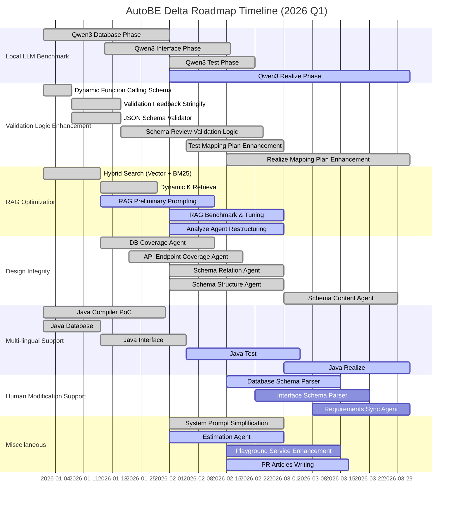

```mermaid
gantt
  dateFormat YYYY-MM-DD
  title AutoBE Delta Roadmap Timeline (2026 Q1)

  section Local LLM Benchmark
  Qwen3 Database Phase             : done,    2026-01-01, 31d
  Qwen3 Interface Phase            : done,    2026-01-16, 31d
  Qwen3 Test Phase                 : done,    2026-02-01, 21d
  Qwen3 Realize Phase              : active,  2026-02-01, 59d

  section Validation Logic Enhancement
  Dynamic Function Calling Schema  : done, 2026-01-01, 7d
  Validation Feedback Stringify    : done, 2026-01-08, 12d
  JSON Schema Validator            : done, 2026-01-08, 12d
  Schema Review Validation Logic   : done, 2026-01-20, 35d
  Test Mapping Plan Enhancement    : done, 2026-02-05, 24d
  Realize Mapping Plan Enhancement : done, 2026-02-15, 45d

  section RAG Optimization
  Hybrid Search (Vector + BM25)    : done,   2026-01-01, 14d
  Dynamic K Retrieval              : done,   2026-01-15, 14d
  RAG Preliminary Prompting        : active, 2026-01-15, 28d
  RAG Benchmark & Tuning           : active, 2026-02-01, 28d
  Analyze Agent Restructuring      : active, 2026-02-01, 28d

  section Design Integrity
  DB Coverage Agent                : done, 2026-01-15, 28d
  API Endpoint Coverage Agent      : done, 2026-01-22, 28d
  Schema Relation Agent            : done, 2026-02-01, 28d
  Schema Structure Agent           : done, 2026-02-01, 28d
  Schema Content Agent             : done, 2026-03-01, 28d

  section Multi-lingual Support
  Java Compiler PoC                : done,   2026-01-01, 30d
  Java Database                    : done,   2026-01-01, 14d
  Java Interface                   : done,   2026-01-15, 21d
  Java Test                        : active, 2026-02-05, 28d
  Java Realize                     : active, 2026-03-01, 31d

  section Human Modification Support
  Database Schema Parser           : active,  2026-02-15, 28d
  Interface Schema Parser          : planned, 2026-02-22, 28d
  Requirements Sync Agent          : planned, 2026-03-08, 24d

  section Miscellaneous
  System Prompt Simplification     : done,    2026-02-01, 28d
  Estimation Agent                 : active,  2026-02-01, 28d
  Playground Service Enhancement   : planned, 2026-02-15, 28d
  PR Articles Writing              : active,  2026-02-15, 30d
```
